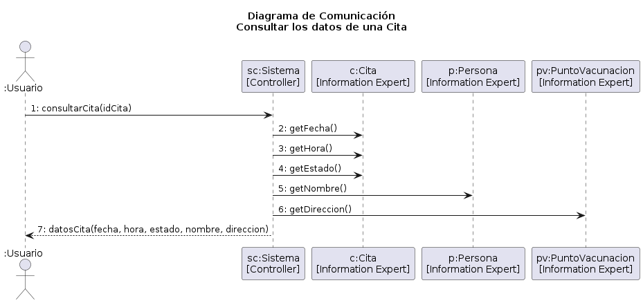

Disclaimer: En el codigo del proyecto, "Persona" esta señalado como "Usuario", para evitar confusiones con el actor externo se le otorgo el nombre "Persona" en este diagrama.

## GRASP

Controller: El sistema es el controlador del flujo. Representa a todo el sistema frente al actor.
Information Expert: Cita conoce su fecha, hora y estado.
Information Expert: Persona conoce su nombre y RUT.
Information Expert: PuntoVacunacion conoce su direccion.
Bajo Acoplamiento: El sistema no pasa de Cita a Persona sino que consulta a cada objeto por separado de forma directa.

## Escenario Principal de Exito:

1. El Usuario agenda una cita.
2. El Usuario ingresa el identificador de la cita. (Paso 1)
3. El Sistema obtiene la fecha de la cita. (Paso 2) [Cita es un Information Expert, por lo que solo cita conoce su fecha_cita.]
4. El Sistema obtiene la hora de la cita. (Paso 3) [Solo cita conoce su hora_cita.]
5. El Sistema obtiene el estado actual de la cita. (Paso 4) [Solo cita conoce su estado_cita.]
6. El Sistema obtiene el nombre de la persona a la que esta asignada la cita. (Paso 5) [Persona es un Information Expert, solo Persona conoce su nombre]
7. El Sistema obtiene la direccion del Punto de Vacunacion. (Paso 6) [PuntoVacunacion es un Information Expert, solo PuntoVacunacion conoce su direccion]
8. El Sistema finalmente retorna los datos de la cita al Usuario, mostrando la fecha, hora, direccion y Persona asociados a la Cita. (Paso 7)