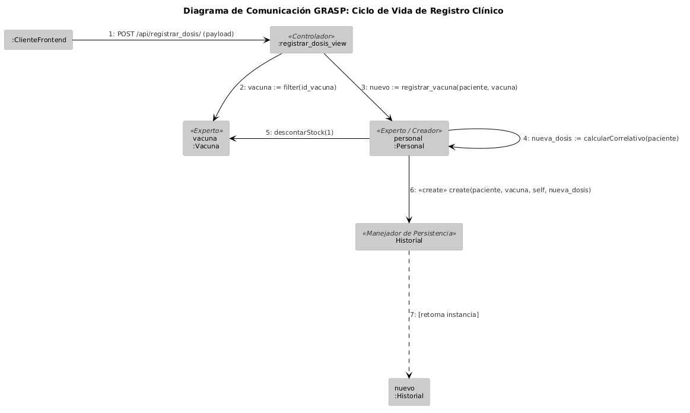

##GRASP
Controller: registrar_dosis_view actúa como el controlador; recibe la petición HTTP desde el frontend, valida la sesión y el rol de usuario, y coordina la ejecución sin contener lógica de negocio interna.

Information Expert: Personal es el experto en el acto clínico; conoce quién está realizando el registro y calcula la dosis correspondiente basándose en el historial.

Information Expert: Vacuna es el experto en el inventario; conoce su nombre, ID y el stock actual disponible.

Creator: Personal es el creador del Historial (la dosis aplicada), ya que posee toda la información necesaria (quién, a quién, qué vacuna y número de dosis) para instanciar el objeto de forma íntegra.

Bajo Acoplamiento: La vista no manipula directamente las tablas de la base de datos; delega las acciones a las entidades del modelo (Personal, Vacuna), manteniendo la interfaz web aislada de la estructura de persistencia.

##Escenario Principal de Éxito: Registro de Vacunación.

1. El Personal registra una dosis aplicada a un Usuario.

2. El Sistema recibe la petición POST con los datos del paciente y la vacuna. (Paso 1: Controlador)

3. El Sistema busca la vacuna en la base de datos mediante su identificador. (Paso 2: Vacuna es Information Expert sobre su stock y nombre).

4. El Sistema obtiene la instancia del Usuario receptor mediante su RUT. (Paso 3)

5. El Sistema invoca el método de registro en el objeto Personal. (Paso 4)

6. El Sistema calcula el número de dosis correlativa (1ª, 2ª o refuerzo) consultando el historial previo del usuario. (Paso 5: Personal es Information Expert en la lógica del procedimiento clínico).

7. El Sistema descuenta una unidad del stock de la vacuna aplicada. (Paso 6: Vacuna es Information Expert en su inventario).

8. El Sistema crea y guarda un nuevo registro en el Historial con los datos vinculados. (Paso 7: Personal actúa como Creator del Historial).

9. El Sistema retorna un mensaje de éxito al Personal, confirmando la dosis, vacuna y fecha aplicada. (Paso 8)